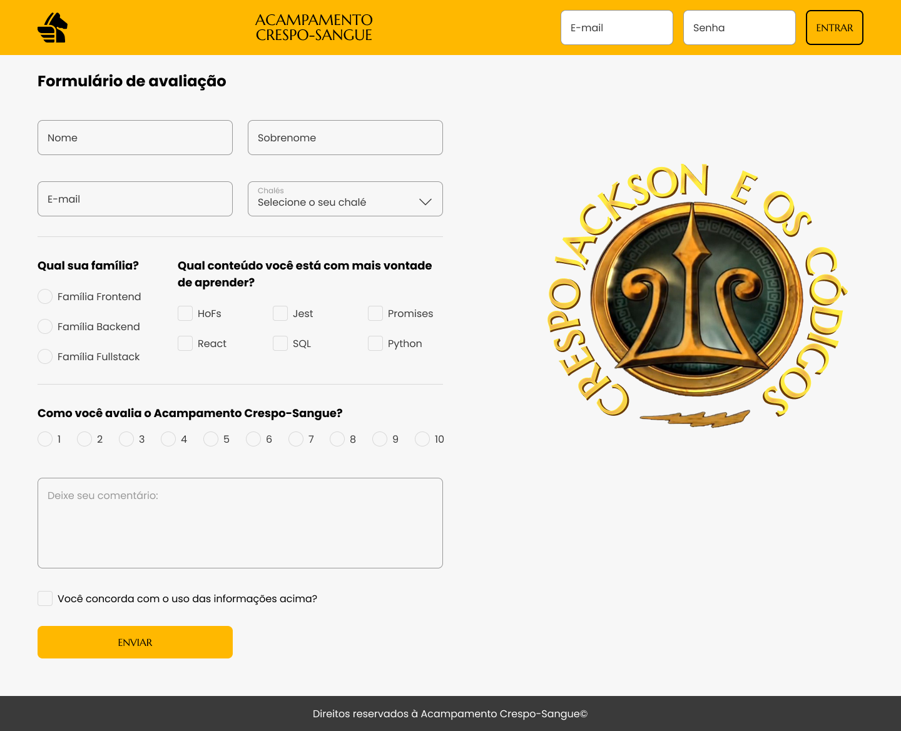
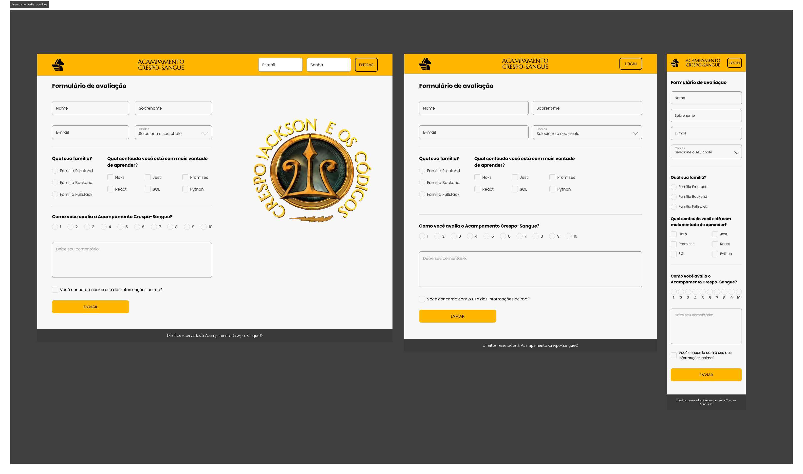

# 🏕️ Página Acampamento Crespo-Sangue

Esse repositório tem como objetivo, criar uma landing page responsiva de formulário para avaliação de curso,, onde o usuário possa colocar seus dados e o botão só estará disponível quando ele aceitar os termos. O repositório oferece um formulário simples.  

## 📝 Layout definido e seus responsivos.

  
<strong>🪄 Design final e seu responsivo </strong>
 

## 💻  Funcionalidades
- `Colocar seus dados:` O usuário coloca seus dados para poder avaliar o curso.
- `Botão disabled:` O botão só estará disponível caso o usuário concorde com o uso das informações .
- `É enviado os dados:` O usuário pode revisar os dados que colocou.
  

## 👨‍💻 Como Usar
1. **Clone o Repositório:** `git clone git@github.com:Jonatan-Crespo/Acampamento_Crespo-Sangue.git`
2. **Acesse o Diretório do Projeto:** `cd Acampamento_Crespo-Sangue`
3. **Abra o Aplicativo:** Abra o arquivo `index.html` no seu navegador web preferido.
4. **Coloque seus dados:** Preencha o formulário, para poder habilitar o botão e enviar os dados.
5. **Envie os dados:** Envie e revise seus dados, em uma modal de revisão.
  

## 🎨 Exemplo de como ficou o projeto

  

## 🏆 Contribuindo
Sinta-se à vontade para contribuir com melhorias ou novas funcionalidades para este projeto. Siga estes passos:
 
1. Faça um fork do repositório (`Fork` no canto superior direito da página).
2. Clone o seu fork localmente.
3. Crie um branch para a sua contribuição (`git checkout -b feature/nova-funcionalidade`).
4. Faça as alterações desejadas e faça commits explicativos (`git commit -m 'Adicionando nova funcionalidade'`).
5. Envie as alterações para o seu fork no GitHub (`git push origin feature/nova-funcionalidade`).
6. Abra um pull request no repositório original.
  

## 📝 Licença
Este projeto está licenciado sob a [Licença MIT](link-para-o-arquivo-de-licenca), o que significa que você pode utilizá-lo livremente, inclusive para fins comerciais.

